---

```markdown
# ReadAI Task Automation

**Automated Task Extraction and Management from Meeting Transcripts**
A Node.js/Express application integrated with OpenAI, Notion, and Slack to extract, normalize, and manage tasks from meeting transcripts.

---

## 📖 Executive Summary
This system serves as an intelligent middleware between unstructured communication (Zoom/Teams meetings) and structured project management (Notion).

Instead of blindly dumping AI-generated tasks into a database, it uses a **Model Context Protocol (MCP)** architecture. This separates the processing context from execution and features a **Sequential Queue Engine** that presents tasks one by one in Slack. This ensures no data enters the permanent record without explicit human validation.

---

## 🚀 Key Features

* **⚡ Automated Ingestion:** Listens for `meeting_end` webhooks from **Read.ai**. The moment a call finishes, the system parses the transcript.
* **🧠 Intelligent Context:**
    * **Project Routing:** Detects if a meeting is about specific projects (e.g., "Island Way" vs. "Ridge Oak") and routes tasks to the correct Notion database.
    * **Identity Mapping:** Maps email addresses to Notion User Tags.
* **🚦 Sequential Queue Engine:** Prevents Slack channel flooding. The system holds tasks in memory and sends proposals **one by one**, waiting for user action (Accept/Skip) before proceeding.
* **⚡ Async UI:** Uses optimistic UI updates to ensure the Slack "Accept" button feels instant, even while performing complex Notion writes in the background.

---

## 🏗️ Architecture

The system follows a linear pipeline: **Input** → **Processing** → **Validation** → **Storage**.

```mermaid
flowchart LR
    %% --- INPUTS ---
    subgraph Inputs ["📂 INPUT SOURCES"]
        direction TB
        ReadAI["⚡ Read.ai Webhook"]
        Manual["📂 File Upload"]
    end

    %% --- PROCESSING ---
    subgraph Process ["⚙️ PROCESSING CORE"]
        direction TB
        Orch["📡 ORCHESTRATOR"]
        MCP["🧠 MCP SERVER"]
        Queue["⏳ SEQUENTIAL QUEUE"]
    end

    %% --- INTERACTION ---
    subgraph Interaction ["👤 VALIDATION"]
        direction TB
        SlackOut["🤖 Slack Bot"]
        User(("👤 Manager"))
    end

    %% --- STORAGE ---
    subgraph Storage ["💾 STORAGE"]
        Notion[("📚 Notion DB")]
    end

    %% CONNECTIONS
    ReadAI ==>|"1. JSON"| Orch
    Orch <==>|"2. Normalized Text"| MCP
    MCP <==>|"3. Context Check"| Notion
    
    MCP ==>|"4. Enqueue"| Queue
    Queue ==>|"5. Proposal Card"| SlackOut
    SlackOut <==>|"6. Accept/Skip"| User
    
    User ==>|"7. Write"| MCP
    MCP ==>|"8. Save"| Notion
    MCP -.->|"9. Next Task"| Queue

    %% STYLE CLASSES
    classDef darkNode fill:#333,stroke:#fff,stroke-width:2px,color:#fff;
    class ReadAI,Manual,Orch,MCP,Queue,SlackOut,User,Notion darkNode;

```



---

## 🛠️ Tech Stack

| Component | Technology | Protocol | Role |
| --- | --- | --- | --- |
| **Orchestrator** | Node.js / Express | HTTP Webhook | Ingests & normalizes Read.ai JSON payloads. |
| **MCP Server** | Node.js (Custom) | HTTP / REST | The "Brain." Handles business logic, queuing, and AI. |
| **AI Model** | OpenAI GPT-5.2 | API | Extracts actionable tasks from unstructured text. |
| **Database** | MongoDB | TCP / Native | Stores transient logs and trace IDs. |
| **Storage** | Notion API | HTTPS | Permanent record for Tasks and Projects. |
| **Interface** | Slack Block Kit | Webhook | Interactive approvals (Buttons, Modals). |

---

## ⚙️ Installation & Setup

### 1. Clone the Repository

```bash
git clone [https://github.com/sajaddeen/readai-task-automation.git](https://github.com/sajaddeen/readai-task-automation.git)
cd readai-task-automation

```

### 2. Install Dependencies

```bash
npm install

```

### 3. Environment Configuration

Create a `.env` file in the root directory. You must configure the following keys:

```ini
# --- SERVER PORTS ---
ORCHESTRATOR_PORT=3000
MCP_SERVER_PORT=3001
MCP_SERVER_URL=http://localhost:3001

# --- DATABASES ---
MONGODB_URI=mongodb+srv://<user>:<pass>@cluster.mongodb.net/logs
NOTION_API_KEY=secret_...
NOTION_TASK_DB_ID=... (Default Fallback DB ID)

# --- AI & SLACK ---
OPENAI_API_KEY=sk-...
SLACK_BOT_TOKEN=xoxb-...
SLACK_SIGNING_SECRET=...

```

### 4. Run the Application

```bash
npm run start:all

```

*This command launches both the Orchestrator (Port 3000) and the MCP Server (Port 3001).*

---

## 🔌 API Endpoints

### 1. Read.ai Webhook (Automated)

* **URL:** `POST /api/v1/webhook`
* **Description:** Receives the `meeting_end` event from Read.ai.
* **Payload:** Standard Read.ai JSON schema.

### 2. Manual File Upload

* **URL:** `POST /api/v1/transcript`
* **Description:** Allows manual upload of `.docx` or `.txt` transcript files.
* **Body:** `form-data` with key `transcriptFile`.

---

## 🔗 Integration Guide: Read.ai

To connect your automated pipeline:

1. Log in to the **Read.ai Dashboard**.
2. Go to **Integrations > Webhooks**.
3. Click **Add Webhook**.
4. **Endpoint URL:** `https://<YOUR_DOMAIN>/api/v1/webhook`
5. **Trigger Events:** Select **"Meeting End"**.
6. Save.

*Now, every time a meeting finishes, the system will automatically generate task proposals in Slack.*

---

## 🔮 Future Roadmap

* **Phase 2: Relational Linking:** Automatically link tasks to specific "Jobs To Be Done" or "Materials" databases in Notion based on keywords.
* **Phase 3: Meeting Minutes:** A secondary mode to generate and save formatted Executive Summaries alongside tasks.
* **Phase 4: Visual Inputs:** Support for processing photos of whiteboards and site inspections.

---

## 📄 License

Private Repository. All rights reserved.

```

```
